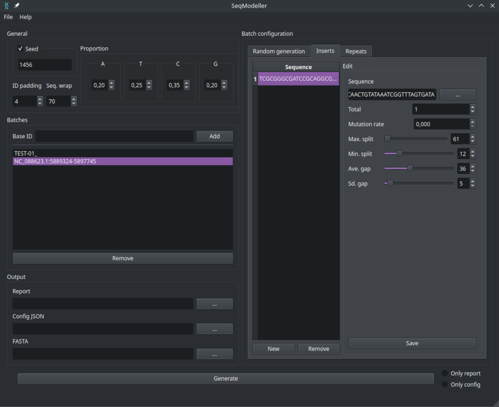

# SeqModeller

A powerful GUI application for generating synthetic DNA sequences with customizable patterns, insertions, and repeats. Perfect for bioinformatics research, testing sequence analysis tools, and creating controlled datasets.



## Features

- **Intuitive GUI**: Easy-to-use interface built with PyQt6
- **Flexible Sequence Generation**: Configure nucleotide proportions, sequence lengths, and generation counts
- **Pattern Repeats**: Add repeating patterns with customizable likelihood and repetition ranges
- **Sequence Insertions**: Insert specific sequences with mutation rates and split configurations
- **Batch Processing**: Generate multiple sequence batches with different parameters
- **Multiple Output Formats**: Generate FASTA files, detailed reports, and JSON configurations
- **Session Management**: Recent files with persistent output path associations
- **Import/Export**: Save and load configurations for reproducible results

## Installation

### System Requirements
- **Operating System**: Linux, Windows, or macOS
- **Python**: 3.10 or higher (for source installation)

### Method 1: Using the Compiled Binary (Easiest)

If you are on **Linux x86-64**, you can download and run the precompiled binary:

1. Download the latest release:
   ```bash
   wget https://github.com/Dannyzimmer/SeqModeller/releases/download/v0.2.0/SeqModeller_v0.2.0_linux_x64.zip
   ```

2. Extract and run:
   ```bash
   unzip SeqModeller_v0.2.0_linux_x64.zip
   cd SeqModeller_v0.2.0_linux_x64
   ./SeqModeller
   ```

> [!NOTE]
> If the binary doesn't work on your system, try the conda environment method below.

### Method 2: Using Conda Environment (Recommended)

This method works on all supported platforms and provides the most reliable installation.

1. **Clone the repository**:
   ```bash
   git clone https://github.com/Dannyzimmer/SeqModeller.git
   cd SeqModeller
   ```

2. **Create and activate the Conda environment**:
   ```bash
   conda env create -f environment.yml
   conda activate seqmodeller
   ```

3. **Run the application**:
   ```bash
   python3 main.py
   ```

### Method 3: Manual Installation (Advanced Users)

If you prefer to install dependencies manually or encounter issues with the conda environment:

1. **Install Python dependencies**:
   ```bash
   pip install PyQt6 PyQt6-tools PySide6
   ```

2. **Clone and run**:
   ```bash
   git clone https://github.com/Dannyzimmer/SeqModeller.git
   cd SeqModeller
   python3 main.py
   ```

### Building Resources (Optional)

If you modify the UI files or resources, you can rebuild them:

```bash
conda activate seqmodeller
python3 ./dev/build_resources.py --all --verbose
```

## Quick Start

1. **Configure General Settings**: Set ID padding, sequence wrapping, and nucleotide proportions
2. **Add Sequence Batches**: Click "Add" to create new sequence batches with unique Base IDs
3. **Configure Generation**: Set the number of sequences, min/max lengths for each batch
4. **Add Patterns** (optional): Define repeating patterns with likelihood and repetition ranges
5. **Add Insertions** (optional): Insert specific sequences with mutation and split parameters
6. **Set Output Files**: Choose where to save your FASTA, report, and configuration files
7. **Generate**: Click "Generate" to create your synthetic sequences

## Configuration Structure

SeqModeller uses JSON configuration files with the following structure:

```json
{
    "id_padding": 4,
    "seq_wrap": 70,
    "seed": 12345,
    "sequences": [
        {
            "base_id": "TEST",
            "generate": 10,
            "max_len": 1000,
            "min_len": 500,
            "proportion": {"A": 0.25, "T": 0.25, "C": 0.25, "G": 0.25},
            "repeats": [
                {
                    "likelihood": 0.5,
                    "pattern": "ATCG",
                    "pattern_max_reps": 50,
                    "pattern_min_reps": 10
                }
            ],
            "inserts": [
                {
                    "total": 4,
                    "max_split": 2,
                    "min_split": 0,
                    "ave_gap": 100,
                    "sd_gap": 20,
                    "mutation_rate": 0.05,
                    "sequence": "ATCGATCGATCG"
                }
            ]
        }
    ]
}
```

## Output Files

- **FASTA**: Standard FASTA format with generated sequences
- **Report**: Detailed generation statistics and parameters
- **Config JSON**: Complete configuration for reproducibility

## Advanced Features

### Pattern Repeats
- Define custom DNA patterns that repeat throughout sequences
- Set likelihood of occurrence and min/max repetition counts
- Useful for simulating microsatellites or tandem repeats

### Sequence Insertions
- Insert specific sequences at random positions
- Configure mutation rates for realistic variation
- Control sequence splitting and gap distribution
- Perfect for simulating known motifs or regulatory elements

### Session Management
- Recent files menu with automatic path association
- Persistent settings across application sessions
- Easy project switching and configuration reuse

## License

This project is licensed under the MIT License - see the LICENSE file for details.

## Support

For questions, bug reports, or feature requests, please open an issue on GitHub.